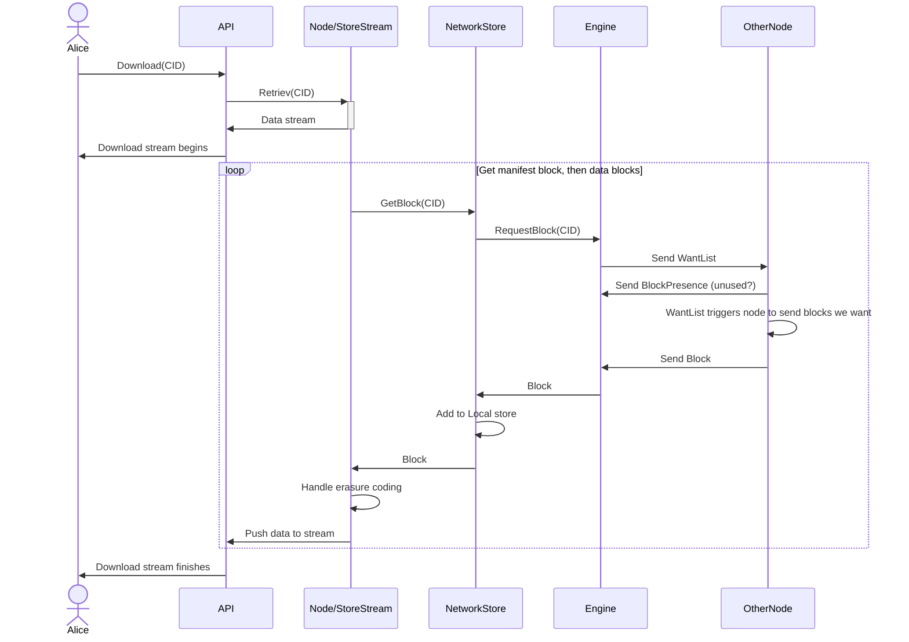

# Download Flow
Sequence of interactions that result in dat blocks being transferred across the network.

## Local Store
When data is available in the local blockstore,

## Network Store
When data is not found ih the local blockstore, the block-exchange engine is used to discover the location of the block within the network. Connection will be established to the node(s) that have the block, and exchange can take place.

