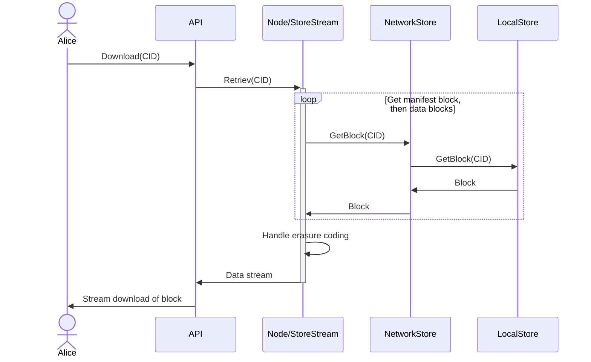

# Download Flow
Sequence of interactions that result in dat blocks being transferred across the network.

## Local Store
When data is available in the local blockstore,

```mermaid
sequenceDiagram
actor Alice
participant API
Alice->>API: Download(CID)
API->>+Node/StoreStream: Retriev(CID)
loop Get manifest block, then data blocks
    Node/StoreStream->>NetworkStore: GetBlock(CID)
    NetworkStore->>LocalStore: GetBlock(CID)
    LocalStore->>NetworkStore: Block
    NetworkStore->>Node/StoreStream: Block
end
Node/StoreStream->>Node/StoreStream: Handle erasure coding
Node/StoreStream->>-API: Data stream
API->>Alice: Stream download of block
```
