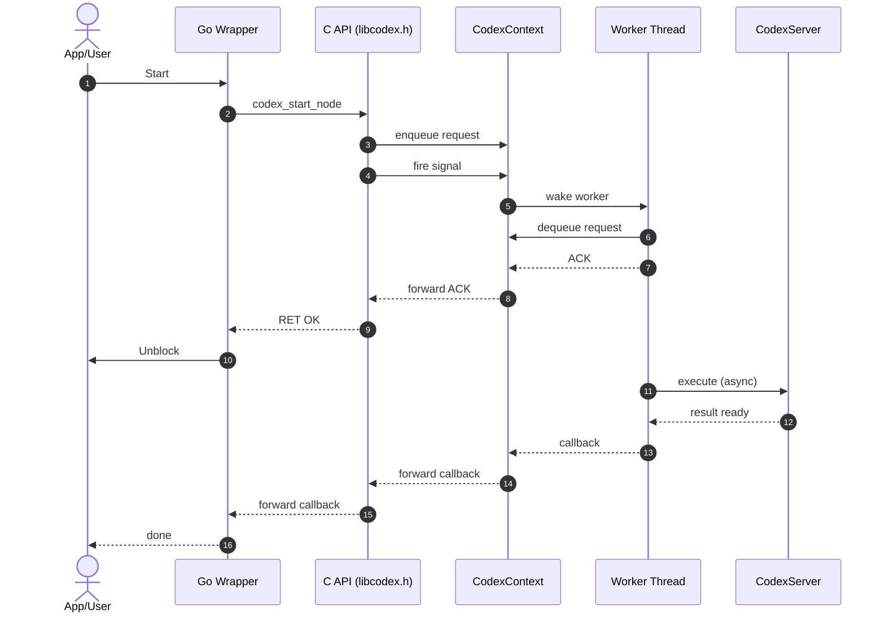

# Codex Library

Codex exposes a C binding that serves as a stable contract, making it straightforward to integrate Codex into other languages such as Go.

The implementation was inspired by [nim-library-template](https://github.com/logos-co/nim-library-template)  
and by the [nwaku](https://github.com/waku-org/nwaku/tree/master/library) library.

The source code contains detailed comments to explain the threading and callback flow.  
The diagram below summarizes the lifecycle: context creation, request execution, and shutdown.

