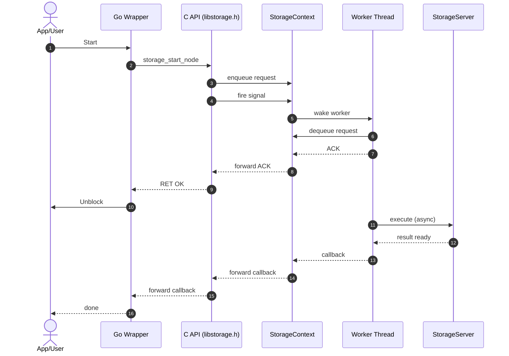

# Logos Storage Library

Logos Storage exposes a C binding that serves as a stable contract, making it straightforward to integrate Logos Storage into other languages such as Go.

The implementation was inspired by [nim-library-template](https://github.com/logos-co/nim-library-template)  
and by the [nwaku](https://github.com/waku-org/nwaku/tree/master/library) library.

The source code contains detailed comments to explain the threading and callback flow.  
The diagram below summarizes the lifecycle: context creation, request execution, and shutdown.

```mermaid
sequenceDiagram
    autonumber
    actor App as App/User
    participant Go as Go Wrapper
    participant C as C API (libstorage.h)
    participant Ctx as StorageContext
    participant Thr as Worker Thread
    participant Eng as StorageServer

    App->>Go: Start
    Go->>C: storage_start_node
    C->>Ctx: enqueue request
    C->>Ctx: fire signal
    Ctx->>Thr: wake worker
    Thr->>Ctx: dequeue request
    Thr-->>Ctx: ACK
    Ctx-->>C: forward ACK
    C-->>Go: RET OK 
    Go->>App: Unblock
    Thr->>Eng: execute (async)
    Eng-->>Thr: result ready
    Thr-->>Ctx: callback
    Ctx-->>C: forward callback
    C-->>Go: forward callback
    Go-->>App: done
```

## API reference
Please see the [API reference](https://logos-storage.github.io/logos-storage-docs/storage/node/reference/libstorage-api).

## Go wrapper

A Go wrapper is available [here](https://github.com/logos-storage/logos-storage-go-bindings).

## Rust Wrapper

A Rust wrapper is available [here](https://github.com/nipsysdev/storage-rust-bindings).