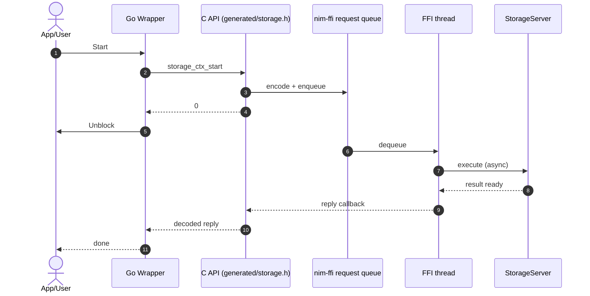

# Logos Storage Library

Logos Storage exposes a C binding that serves as a stable contract, making it straightforward to integrate Logos Storage into other languages such as Go.

The binding is generated by [nim-ffi](https://github.com/logos-messaging/nim-ffi), which also supplies the whole FFI runtime: a dedicated worker thread, a request queue, the CBOR wire and an event thread. The same approach is used by [logos-delivery](https://github.com/logos-messaging/logos-delivery).

## Layout

| File | Holds |
| --- | --- |
| `declare_lib.nim` | `declareLibrary("storage", Storage)` and the `Storage` alias the generated C type names follow |
| `node_factory.nim` | `createStorage`, which turns the configuration JSON into a `StorageServer`. No FFI pragmas, so the unit tests drive it directly |
| `events.nim` | The `{.ffiEvent.}` declarations |
| `storage_api/*.nim` | One module per area; every entry point is a `{.ffi.}` proc |
| `libstorage.nim` | Imports the API modules and calls `genBindings()` last |
| `libstorage.h` | Includes the generated header and declares the synchronous entry points |

## Build

```bash
make libstorage           # dynamic (.so/.dylib/.dll)
make STATIC=1 libstorage  # static (.a)
```

The build writes `library/generated/storage.h` plus its TinyCBOR helpers. That directory is a build artifact and is not checked in, so build the library before you compile against `library/libstorage.h`.

## Call model

Every entry point except `storage_version` and `storage_revision` is asynchronous. A call encodes its arguments, hands them to the worker thread and returns at once; the answer arrives on the result callback.


```mermaid
sequenceDiagram
    autonumber
    actor App as App/User
    participant Go as Go Wrapper
    participant C as C API (generated/storage.h)
    participant Q as nim-ffi request queue
    participant Thr as FFI thread
    participant Eng as StorageServer

    App->>Go: Start
    Go->>C: storage_ctx_start
    C->>Q: encode + enqueue
    C-->>Go: 0
    Go->>App: Unblock
    Q->>Thr: dequeue
    Thr->>Eng: execute (async)
    Eng-->>Thr: result ready
    Thr-->>C: reply callback
    C-->>Go: decoded reply
    Go-->>App: done
```

The result callback receives one of:

- `RET_OK` (0): terminal, `reply` carries the decoded answer
- `RET_ERR` (1): terminal, `err_msg` carries the reason
- `RET_MISSING_CALLBACK` (2): no callback was passed
- `NIMFFI_RET_STALE_WARN` (3): non-terminal ping every 5s while the handler runs. The generated typed wrappers swallow it; only the raw exports see it.

The generated header offers two layers. Use the typed `storage_ctx_*` wrappers: they encode the request, decode the reply and hand it to you as a C struct. The raw `storage_*` exports take a CBOR buffer and exist for a host that encodes the wire itself.

Reply values and error strings belong to the binding and live only for the duration of the callback, so copy what you keep. Request-side strings are borrowed; wrap them with `nimffi_str()`.

## Lifecycle

```c
StorageCtx *ctx = NULL;  // filled by the create callback

storage_ctx_create(nimffi_str(config_json), on_created, user_data);
storage_ctx_start(ctx, on_reply, user_data);
storage_ctx_stop(ctx, on_reply, user_data);
storage_ctx_destroy(ctx);
```

`storage_ctx_destroy` stops the node, closes it and joins the FFI thread pair. It is synchronous and is the only teardown path: a context lives exactly as long as its node.

## Entry points

`storage_ctx_<name>(ctx, args..., on_reply, user_data)` for every row below. Each answers `Result[string, string]` unless stated otherwise.

| Wrapper | Arguments | Returns |
| --- | --- | --- |
| `storage_ctx_create` | `configJson` | the context handle |
| `storage_ctx_start` | | empty |
| `storage_ctx_stop` | | empty |
| `storage_ctx_destroy` | | synchronous status code |
| `storage_ctx_repo` | | the data directory |
| `storage_ctx_spr` | | the Signed Peer Record URI |
| `storage_ctx_peer_id` | | the libp2p peer identity |
| `storage_ctx_debug` | | node information as JSON |
| `storage_ctx_peer_debug` | `peerId` | a peer record as JSON, with `storage_enable_api_debug_peers` |
| `storage_ctx_get_metrics` | | the metrics registry as JSON |
| `storage_ctx_log_level` | `logLevel` | empty |
| `storage_ctx_connect` | `peerId`, `peerAddresses` | empty |
| `storage_ctx_upload_init` | `filepath`, `chunkSize` | the session id |
| `storage_ctx_upload_chunk` | `sessionId`, `data` | empty |
| `storage_ctx_upload_finalize` | `sessionId` | the CID |
| `storage_ctx_upload_cancel` | `sessionId` | empty |
| `storage_ctx_upload_file` | `sessionId` | the CID |
| `storage_ctx_download_init` | `cid`, `chunkSize`, `local` | empty |
| `storage_ctx_download_chunk` | `cid` | the chunk as `NimFfiBytes`, empty at EOF |
| `storage_ctx_download_stream` | `cid`, `chunkSize`, `local`, `filepath` | empty |
| `storage_ctx_download_cancel` | `cid` | empty |
| `storage_ctx_download_manifest` | `cid` | the manifest as JSON |
| `storage_ctx_list` | | every stored manifest as JSON |
| `storage_ctx_space` | | the quota figures as JSON |
| `storage_ctx_delete` | `cid` | empty |
| `storage_ctx_fetch` | `cid` | the manifest as JSON |
| `storage_ctx_exists` | `cid` | `"true"` or `"false"` |
| `storage_ctx_toggle_private_queries` | `enabled` | the previous setting |

`chunkSize` defaults to the block size (`1024 * 64` bytes) when it is 0. `local` restricts a download to the local store.

### Synchronous entry points

Declared in `libstorage.h`, not in the generated header. They need no context and no callback. The returned buffer is thread-local and lives until the next synchronous call on that thread, so copy it.

```c
const char *storage_version(void);
const char *storage_revision(void);
```

## Events

Progress reaches the host through the nim-ffi event thread rather than the result callback. Register one listener per event on the context; the callback must be fast, non-blocking and thread-safe.

```c
uint64_t id = storage_ctx_add_on_download_chunk_listener(ctx, on_chunk, user_data);
storage_ctx_remove_event_listener(ctx, id);
```

| Event | Payload | Fired by |
| --- | --- | --- |
| `on_download_chunk` | `cid`, `data` | `storage_download_stream`, once per chunk |
| `on_upload_progress` | `sessionId`, `storedBytes` | `storage_upload_file`, once per stored block |

## Upload

Two ways to store a file.

Via chunks, where `filepath` is the data file name:
`upload_init` opens a session, `upload_chunk` feeds it, `upload_finalize` returns the CID, `upload_cancel` drops it.

Directly from disk, where `filepath` is an absolute path:
`upload_init` opens a session, `upload_file` streams the file and returns the CID.

## Download

Two ways to read a dataset, both starting with `download_init`.

Via chunks: `download_chunk` returns the next chunk, and an empty reply means EOF. `download_cancel` drops the session.

Via stream: `download_stream` reads to the end, firing `on_download_chunk` for every chunk and writing to `filepath` when it is set. It keeps the worker busy, so it cannot be cancelled.

## Go wrapper

A Go wrapper is available [here](https://github.com/logos-storage/logos-storage-go-bindings).

## Rust Wrapper

A Rust wrapper is available [here](https://github.com/nipsysdev/storage-rust-bindings).
