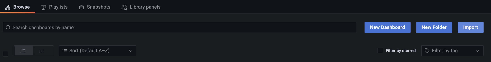
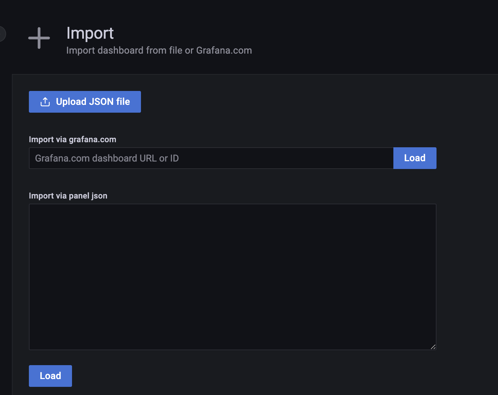
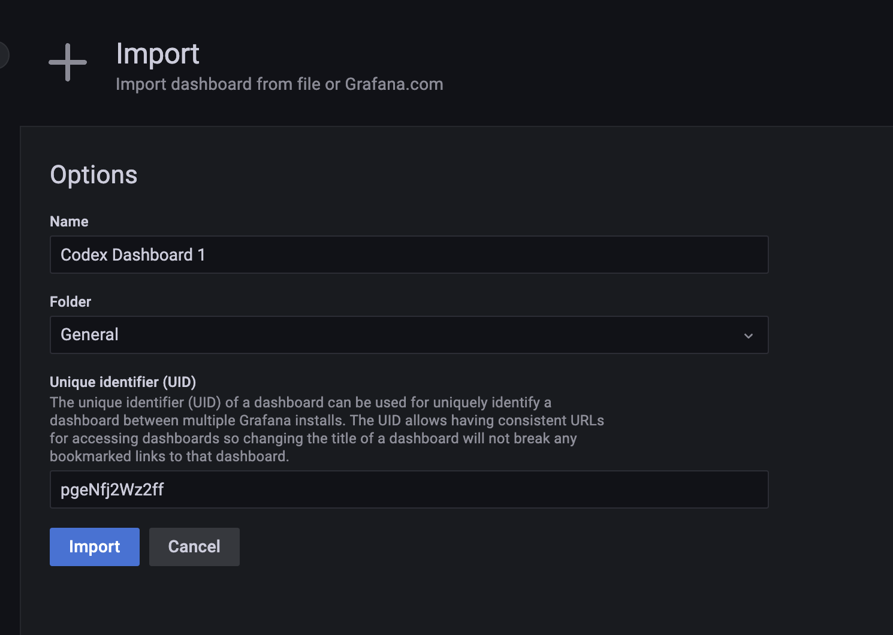

# Codex Metrics and Dashboard

> This readme should help you to get started with collecting and visualizing metrics exposed by the Codex process.

## Metrics

Metrics are collected using the [nim-metrics](https://github.com/status-im/nim-metrics) backend and should be enabled with the `--metrics` flag. By default metrics are exposed on the `localhost:8008/metrics` end point.

Use the `--metrics-address` and `--metrics-port` flags to to adjust the address and port as necessary.

## General guidelines for adding new metrics

Metrics are useful to monitor the health of the process and should aid in identifying and debugging potential issues that would be hard to notice otherwise.

All Codex metrics should be prefixed with the `codex_` prefix to be able to differentiate from metrics exposed by other subsystems. For example libp2p generally prefixed with the `libp2p_` prefix.

Metrics can be added on an as needed basis, however, keep in mind the potential overhead they might introduce. In particular, be careful with labels as they will generate as many metrics as there are labels for a specific collector. If a metrics or a set of metrics are expensive, it is usually advisable to put them behind a compile time flag.

## Prometheus and Grafana

The exposed metrics can be aggregate by the [Prometheus](https://prometheus.io/) monitoring systems and additionally graphed through [Grafana](https://grafana.com/).

This directory contains both the default `prometheus.yml` config file as well as a basic `codex-grafana-dashboard.json` file that can be augmented with additional panels and metrics on an as needed basis.

Additionally, please consider installing the [node_explorer](https://github.com/prometheus/node_exporter) agent to collect machine level metrics such as overall memory, process, networking, disc IO, etc...

### Using the Grafana dashboard

To use the dashboard open grafana and head to `Dashboards`, hit import in the top rightmost button right next to the `New Dashboard` and `New Folder`.

This will take you to the import page.

Use either one of the presented methods (upload json, load from a url or copy paste the json into the text-box), to upload the `codex-grafana-dashboard.json` file.

Finally, you'll be presented with a the following screen where you can change the name and the `UID` of the imported dashboard. This is only necessary if there is already a dashboard with the same name or `UID`.

Once imported, the dashboard should show up on the main dashboard page.
