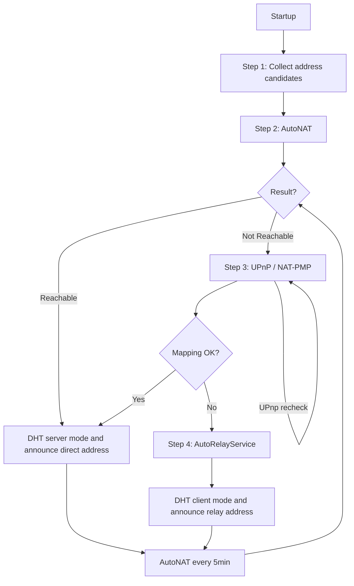

# NAT Traversal

## Context

A logos-storage-nim node needs to tell other peers how to reach it. This is harder than it sounds: most nodes are behind a NAT or a firewall. From the outside, the node looks unreachable.

UPnP / NAT-PMP is already implemented in `nat.nim`. This document describes how we build on top of it using libp2p's AutoNAT to implement a full NAT traversal strategy.

---

## Overview



---

## Step 1: Collecting address candidates

At startup, the node builds a list of IP / port pairs it could announce to other peers.

### IP addresses

If `--listen-ip` is set to a specific address, only that address is used. Otherwise the node scans its network interfaces:

| `--listen-ip` | What gets collected |
| --- | --- |
| `0.0.0.0` (default) | all local IPv4 addresses |
| `::` | all local IPv4 and IPv6 addresses |

### Port

The TCP port comes from `--listen-port`. If not set, a random free port is picked at startup.

---

### Initial announcement

At startup, the node resolves its initial addresses from the routing table and announces them. If `--nat:extip` is set, the static external IP is announced directly instead.

No UPnP or NAT-PMP is attempted at this stage. That happens later in Step 3 if AutoNAT reports the node is not reachable.

The node starts in DHT client mode. AutoNAT (Step 2) runs in the background to check if the node is reachable from the outside, and switches to server mode if confirmed.

This ensures connectivity from the start, whether on a local or public network. If an address turns out to be unreachable, AutoNAT will detect it and update the announced addresses accordingly.

---

### IPv6 specifics

- Do not run UPnP or NAT-PMP on IPv6 addresses: they are directly routable, no port mapping needed. A node with a stable global IPv6 address can skip AutoNAT, UPnP, and relay entirely for that address.
- Some IPv6 addresses are temporary and change over time. If we announce one and it changes, the node becomes unreachable before the DHT records expire. We must only announce the stable address.
- chronos has no support for distinguishing stable addresses from temporary ones. chronos needs to be updated to expose address stability flags.

---

### Initial DHT mode

The DHT has two modes:

- **Server mode**: the node appears in the routing tables of other nodes and answers their discovery requests ([`handleFindNode`](https://github.com/logos-storage/logos-storage-nim-dht/blob/6c7de036224724b064dcaa6b1d898be1c6d03242/codexdht/private/eth/p2p/discoveryv5/protocol.nim#L338), [`handlePing`](https://github.com/logos-storage/logos-storage-nim-dht/blob/6c7de036224724b064dcaa6b1d898be1c6d03242/codexdht/private/eth/p2p/discoveryv5/protocol.nim#L330)). Other nodes use it to route their own lookups.
- **Client mode**: the node can query the DHT and publish provider records (telling the network "I have this content at this address"), but it ignores inbound routing requests and does not appear in routing tables. A node that is not directly reachable must stay in client mode: if it were in server mode, other nodes would try to contact it, get timeouts, and that would degrade the DHT for everyone.

The node starts in client mode. It switches to server mode only after AutoNAT confirms it is reachable (Step 2).

---

## Step 2: AutoNAT

After collecting and filtering addresses (Step 1), the node needs to check if it is actually reachable from the outside. It does this using AutoNAT: it asks a few connected peers to try to connect back to it. Bootstrap nodes are the first peers available for this, as they are dialed at startup.

**Note:** AutoNAT tests TCP reachability via the libp2p switch, we infer UDP reachability from it.

### How it works

The node asks a few peers: "try to connect to me at this address". Each peer attempts the connection and reports success or failure. The results are collected and a confidence score is calculated. When confidence crosses a threshold, the node is marked `Reachable` or `NotReachable`.

### Reference implementation

logos-delivery already has a minimal setup at [`waku/discovery/autonat_service.nim`](https://github.com/logos-messaging/logos-delivery/blob/0b86093247da92060c503544d39e5d0a23922c15/waku/discovery/autonat_service.nim):

```nim
AutonatService.new(
  autonatClient = AutonatClient.new(),
  rng = rng,
  scheduleInterval = Opt.some(30.seconds), # logos-storage uses 5min
  askNewConnectedPeers = true, # triggers a check on first bootstrap connection, avoids waiting 5min at startup
  numPeersToAsk = 3,
  maxQueueSize = 3,
  minConfidence = 0.7,
)
```

### Parameters

| Parameter | logos-delivery | logos-storage | libp2p default | Notes |
| --- | --- | --- | --- | --- |
| `numPeersToAsk` | 3 | 3 | 5 | how many peers are asked per round |
| `maxQueueSize` | 3 | 3 | 10 | how many past results are kept to calculate confidence |
| `minConfidence` | 0.7 | 0.7 | 0.3 | fraction of successful answers needed to confirm a state |
| `scheduleInterval` | 30s | 5min | none | reachability changes rarely in a storage network |
| `askNewConnectedPeers` | false | true | true | triggers a check on first bootstrap connection |

logos-delivery uses a higher confidence threshold (0.7 vs 0.3) and a smaller history window (3 vs 10): fewer samples but a stricter bar to confirm reachability.

libp2p default values are available [here](https://github.com/vacp2p/nim-libp2p/blob/e82080f7b1aa61c6d35fa5311b873f41eff4bb52/libp2p/protocols/connectivity/autonat/service.nim#L60-L64).

## Step 3: UPnP / NAT-PMP (fallback)

If AutoNAT says the node is not reachable, we try to ask the router to open a port using UPnP or NAT-PMP already implemented.

### What already exists

The implementation is already in `nat.nim`:
- [`getExternalIP()`](https://github.com/logos-storage/logos-storage-nim/blob/48f2508b07e51a222070ada72c254927da9c5806/storage/nat.nim#L67): tries UPnP first, then NAT-PMP, returns the external IP
- [`redirectPorts()`](https://github.com/logos-storage/logos-storage-nim/blob/48f2508b07e51a222070ada72c254927da9c5806/storage/nat.nim#L305): creates the port mapping on the router
- [`nattedAddress()`](https://github.com/logos-storage/logos-storage-nim/blob/48f2508b07e51a222070ada72c254927da9c5806/storage/nat.nim#L400): calls both and returns the updated addresses to announce

### The problem

[`nattedAddress()` is called unconditionally at startup](https://github.com/logos-storage/logos-storage-nim/blob/48f2508b07e51a222070ada72c254927da9c5806/storage/storage.nim#L79), before AutoNAT has run. It should only be called when AutoNAT returns `NotReachable`.

### What needs to change

Move the `nattedAddress()` call out of `start()` and into the AutoNAT `statusAndConfidenceHandler`:

```nim
of NotReachable:
  let (announceAddrs, discoveryAddrs) = nattedAddress(
    config.nat, switch.peerInfo.addrs, config.discoveryPort
  )
  discovery.updateAnnounceRecord(announceAddrs)
  discovery.updateDhtRecord(discoveryAddrs)
```

`nattedAddress()` opens a port on the router and starts [`repeatPortMapping`](https://github.com/logos-storage/logos-storage-nim/blob/48f2508b07e51a222070ada72c254927da9c5806/storage/nat.nim#L231) in the background to renew it every [`20 min`](https://github.com/logos-storage/logos-storage-nim/blob/48f2508b07e51a222070ada72c254927da9c5806/storage/nat.nim#L28) (routers forget the mapping on reboot for UPnP, or after [`1 hour`](https://github.com/logos-storage/logos-storage-nim/blob/48f2508b07e51a222070ada72c254927da9c5806/storage/nat.nim#L29) for NAT-PMP). It only needs to be called once, if it fails, the node falls back to relay immediately.

### States

The `statusAndConfidenceHandler` needs to track what has already been tried to avoid re-running UPnP on every AutoNAT cycle:

- `Unknown`
  - `NotReachable`: try UPnP
  - `Reachable`: switch DHT to server
- `UPnP`
  - `NotReachable`: switch DHT to client, start relay
  - `Reachable`: switch DHT to server
  - background: nat.nim renews the mapping every 20 min and fires `onMappingRestored` on restoration
- `Relay`
  - `NotReachable`: do nothing
  - if `hasExtIp: true`: start a background task that periodically asks a peer to dial the static IP. On success, fires the same `onMappingRestored` callback

When applying a state transition: always update announce records first, then change DHT mode, then start or stop the relay. If you set server mode before publishing the new addresses, peers will try to contact you before your records are up to date.

**Note:** nim-libp2p's AutoNAT [filters out relay addresses](https://github.com/vacp2p/nim-libp2p/blob/e82080f7b1aa61c6d35fa5311b873f41eff4bb52/libp2p/protocols/connectivity/autonat/server.nim#L122-L126) before attempting dial-back. A node behind relay will always get `NotReachable` from AutoNAT.

## Step 4: Relay and hole punching

We do not use `HPService` because it starts the relay immediately on `NotReachable`, bypassing the UPnP step. Instead we wire `AutonatService` and `AutoRelayService` directly and control the relay from our own `statusAndConfidenceHandler`.

A node in relay mode can receive inbound connections via the relay, so other peers can download data from it. The relay server acts as a middleman: the node connects to it, reserves a slot, and gets a relay address of the form `/ip4/<relay-ip>/tcp/<relay-port>/p2p/<relay-id>/p2p-circuit/p2p/<node-id>`. It publishes this address in its DHT provider records so peers looking for its content can find and connect to it. It stays in DHT client mode (see Step 1): it can publish provider records but cannot act as a routing hop.

Bootstrap nodes serve as the initial relay servers. `AutoRelayService` finds relay candidates among connected peers, so bootstrap nodes are the first ones used.

### Setup

```nim
let relayClient = RelayClient.new()
let autoRelayService = AutoRelayService.new(2, relayClient, onReservation, rng)

let switch = SwitchBuilder
  .new()
  ...
  .withServices(@[Service(autonatService)])
  .build()
```

The `onReservation` callback updates DHT addresses when relay reservations change:

```nim
proc onReservation(addresses: seq[MultiAddress]) {.gcsafe, raises: [].} =
  discovery.updateAnnounceRecord(addresses)
  discovery.updateDhtRecord(addresses)
```

`updateAnnounceRecord` updates the libp2p peer record (multiaddr, used for content routing). `updateDhtRecord` updates the discv5 node record (SPR, used for peer discovery). Both replace the current set of addresses, they do not accumulate.

### Mapping restored callback

`repeatPortMapping` runs in the background even in `Relay` state, this is how we detect when the mapping comes back. It needs a callback added so we can stop the relay and update addresses when it fires. The external IP may have changed after a router reboot, so we always update regardless.

```nim
proc onMappingRestored(addrs: seq[MultiAddress]) =
  if natState == Relay:
    await autoRelayService.stop(switch)
    natState = UPnP
    # addrs may differ from previously announced ones (e.g. router reboot changed external IP)
    discovery.updateAnnounceRecord(addrs)
    discovery.updateDhtRecord(addrs)
```

### Hole punching

When a peer connects through a relay, libp2p automatically tries to establish a direct connection using dcutr (a protocol for hole punching). If it works, that specific connection bypasses the relay: lower latency and less load on the relay server. This does not change the node's reachability: new peers still need to go through the relay first.

## Step 5: Periodic Re-evaluation

`AutonatService` re-runs every 5 minutes. On each cycle it asks `numPeersToAsk` peers to dial back. If confidence crosses `minConfidence`, `statusAndConfidenceHandler` fires and our handler updates DHT mode, relay state, and announced addresses. The `onMappingRestored` callback from `nat.nim` can also fire independently between cycles.

## What needs to be implemented

- DHT client/server mode in `discovery.nim`: the node currently starts as a DHT server unconditionally
- Move `nattedAddress()` call out of `start()` and into the AutoNAT `statusAndConfidenceHandler`
- Expose a `onRestored` callback in `nat.nim`'s `repeatPortMapping`
- For `hasExtIp: true` (manual port forwarding): add a background task that periodically asks a peer to dial the static IP directly. If it succeeds, fire the same `onMappingRestored` callback. Without this, a node in `Relay` state with a restored manual port forwarding has no way to recover automatically.
- `statusAndConfidenceHandler` with `natState` tracking
- chronos needs to be updated to expose IPv6 address stability flags to distinguish stable SLAAC addresses from temporary ones

## Open questions

- [ ] Mobile nodes: UDP is often blocked on cellular networks. discv5 is UDP-only. How do we support mobile participation?
